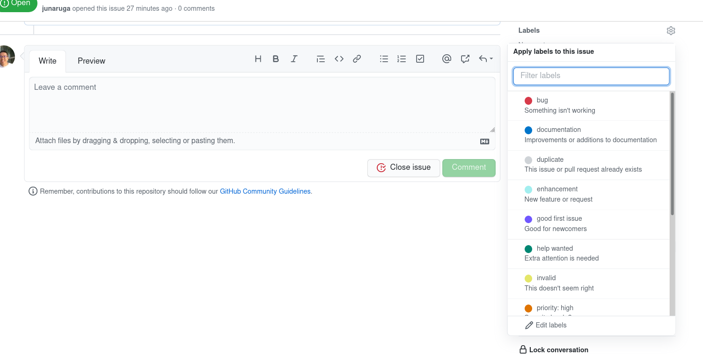
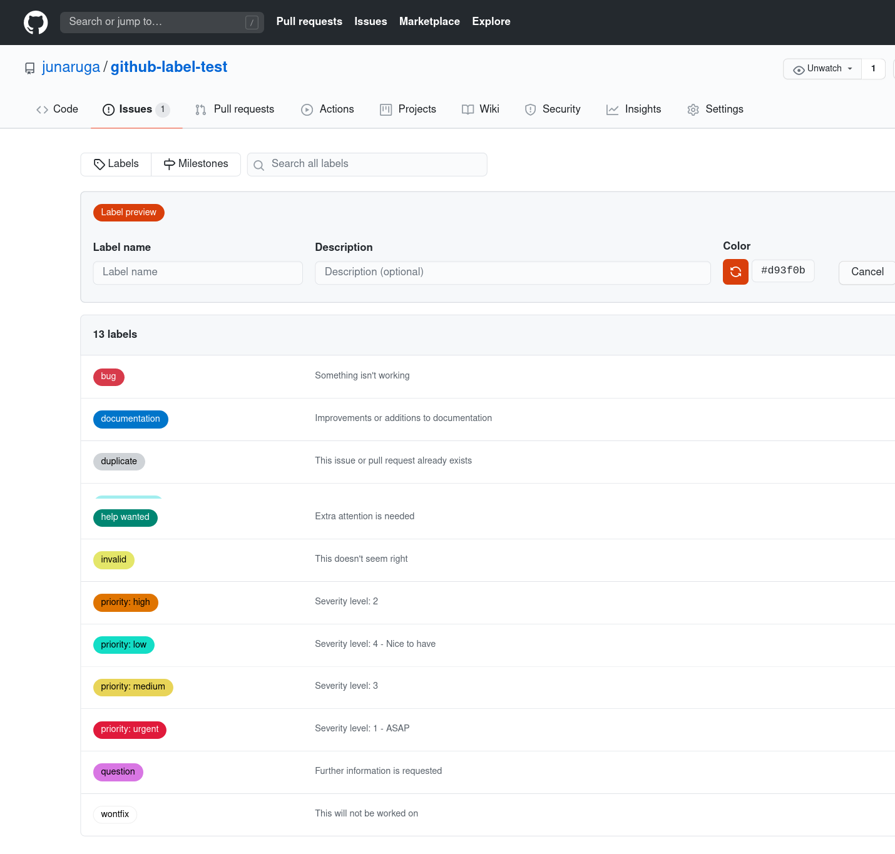

# github-label-test

## Instructions - FNNDSC

1. Go to an issue page on the ChRIS_ultron_backEnd, then Labels - Edit labels link on the right side, or go to https://github.com/FNNDSC/ChRIS_ultron_backEnd/issues/labels directly.

2. You see the following page.

.

3. Edit the label name: `p0: fix - ASAP` to change it to label name: `priority: urgent`, description: `
Severity level: 1 - ASAP` with color: red.
4. Edit the label name: `p1: fix if no pending critical task` to change it to label name: `priority: high`, description: `Severity level: 2` with color orange.
5. Edit the label name `p2: nice to have` to change it to label name: `priority: medium`, description: `Severity level: 3` with color: yellow.
6. Click "New Label" to create a label: label name: `priority: low`, description: `Severity level: 4` with color: blue.

You can refer [the color code](https://html-color-codes.info/).

7. Set the labels priority: urgent/important/low, optionally middle to the necessary issue tickets seeing all the opened tickets on the ChRIS_ultron_backEnd repository. No priority label ticket is okay.

8. After operating the labels on only ChRIS_ultron_backEnd repository for a while, then we can expand the labels to other important repositories.
